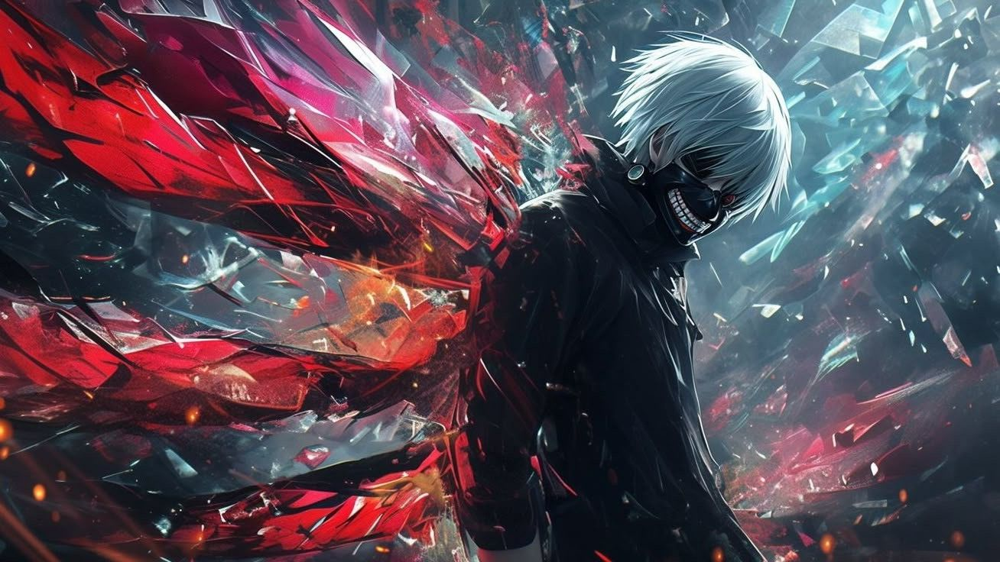
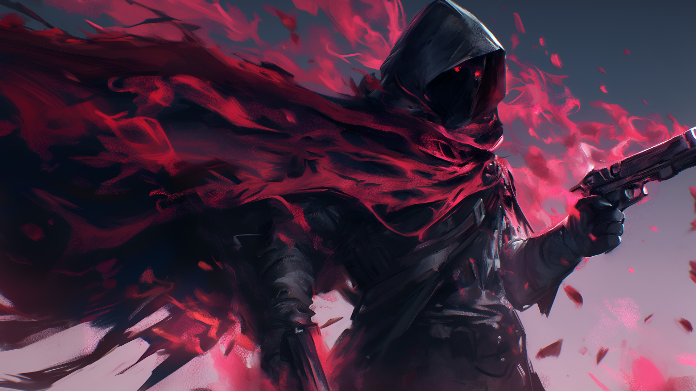
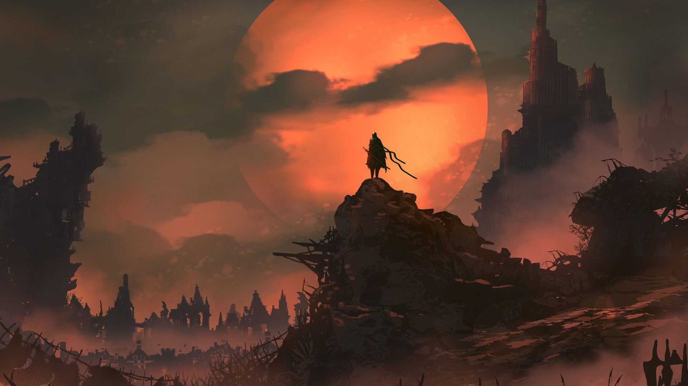
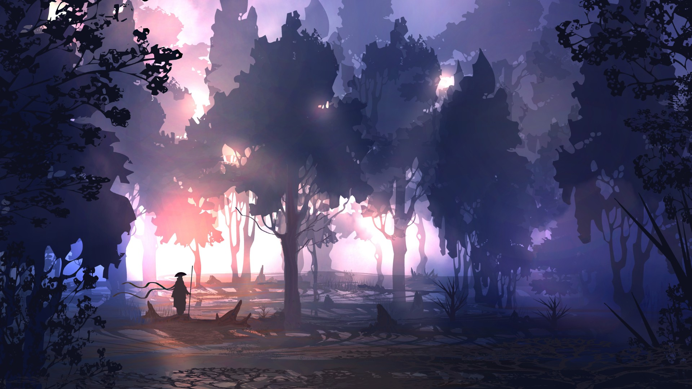
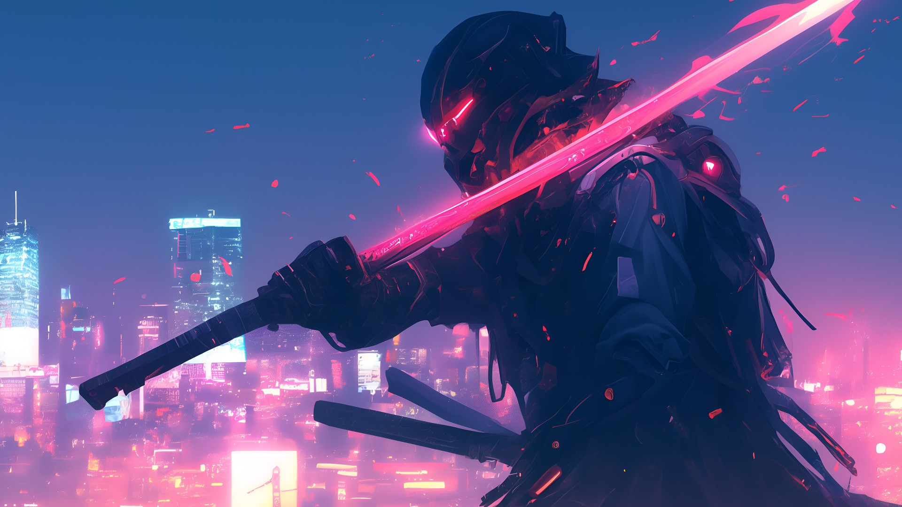
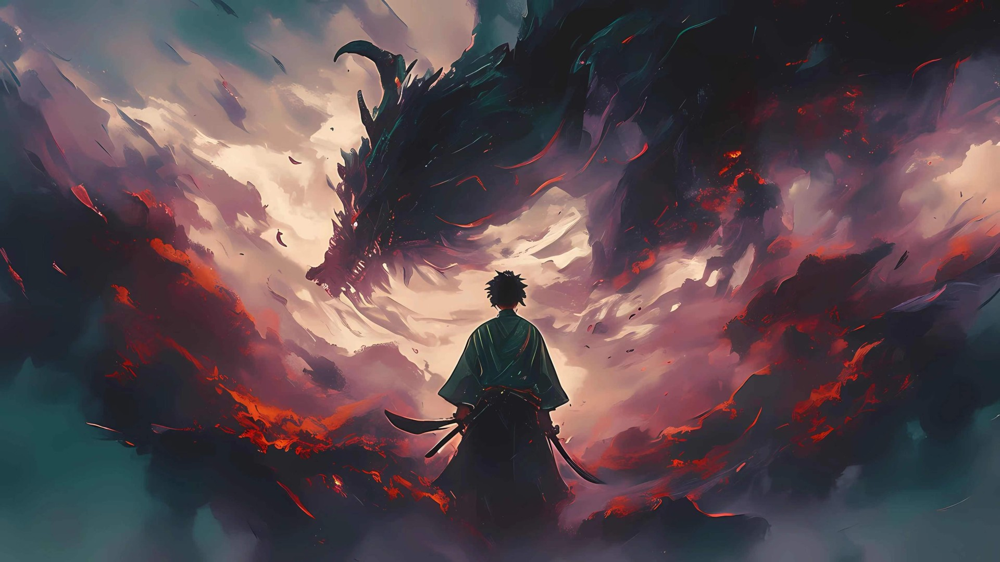
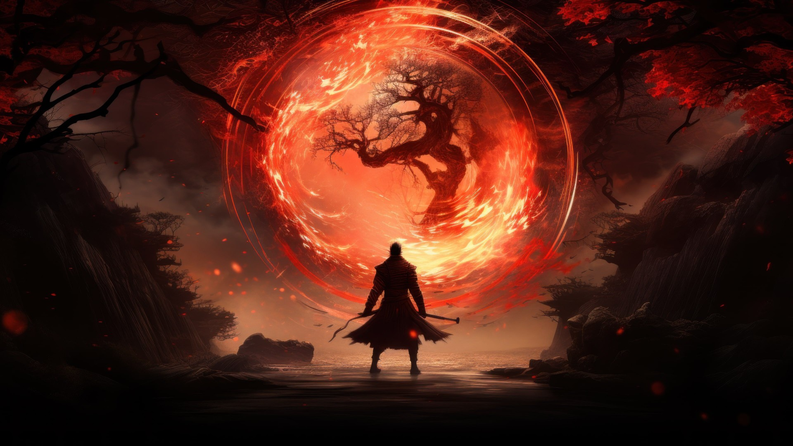
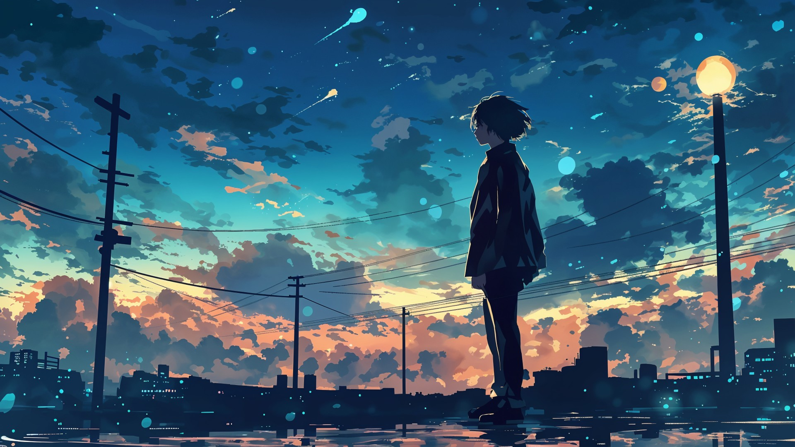
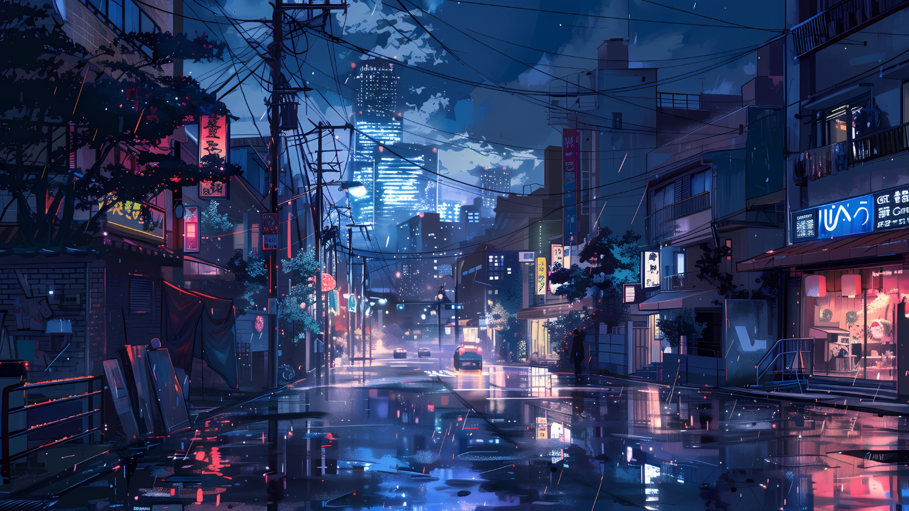

# Wallpapers

A personal collection of wallpapers gathered from multiple sources.

## Categories

* [Anime](Animes/)
* [Cars](Cars/)
* [Desktop](Desktop/)
* [Elden Ring](Elden%20Ring/)
* [Fantasy](Fantasy/)
* [Landscapes](Landscapes/)
* [Pixel Arts](Pixel%20Arts/)
* [Samurai](Samurai/)

## Sources

* https://wallhaven.cc
* https://wallhere.com
* https://deviantart.com
* https://www.reddit.com/r/wallpaper/
* https://backiee.com
* https://alphacoders.com

> [!NOTE]
> I do not own any of these images. All credits belong to their respective artists. Some wallpapers were generated using AI.

---

## Anime

Collection of anime-themed wallpapers featuring characters and scenes from popular series such as Demon Slayer, Naruto, One Piece, and more.

#### Preview

   

**[Browse the Anime collection](Animes/)**

---

## Cars

A collection of automotive wallpapers featuring modern, retro, and stylized vehicles.

#### Preview

   

**[Browse the Cars collection](Cars/)**

---

## Desktop

Desktop-oriented wallpapers including Windows, Microsoft Surface, Arch Linux, abstract designs, and minimalist backgrounds.

#### Preview

   

**[Browse the Desktop collection](Desktop/)**

---

## Elden Ring

Wallpapers inspired by Elden Ring, featuring iconic characters, bosses, environments, and memorable locations from the game.

#### Preview

   

**[Browse the Elden Ring collection](Elden%20Ring/)**

---

## Fantasy

Fantasy-themed wallpapers featuring warriors, mages, dragons, landscapes, and dark fantasy environments.

#### Preview

   

**[Browse the Fantasy collection](Fantasy/)**

---

## Pixel Arts

Pixel art and stylized digital wallpapers featuring cities, landscapes, neon environments, and retro-inspired scenes.

#### Preview

   

**[Browse the Pixel Arts collection](Pixel%20Arts/)**

---

## Samurai

Samurai-themed wallpapers including cyberpunk interpretations, traditional Japanese aesthetics, and cinematic compositions.

#### Preview

   

**[Browse the Samurai collection](Samurai/)**

---

## Landscapes

A large collection of landscape wallpapers including natural environments, fantasy scenes, cyberpunk cities, skies, and atmospheric compositions.

#### Preview

   

**[Browse the Landscapes collection](Landscapes/)**
