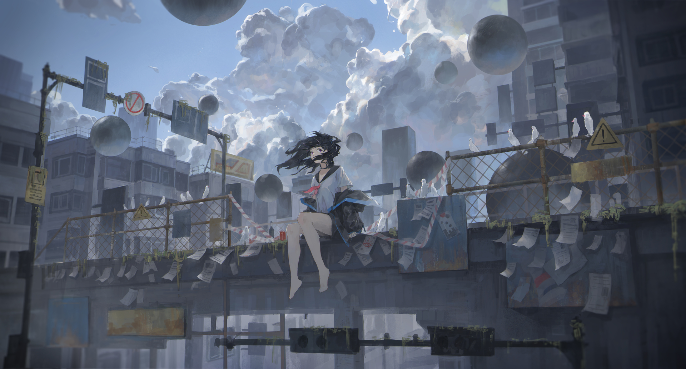

# Wallpapers

A curated collection of free high-quality wallpapers gathered from various sources.

Featuring anime, landscapes, cyberpunk, pixel art and more. This collection is regularly updated with new wallpapers. If you enjoy it, consider giving the repository a ⭐ to stay updated and support the project.

Each folder has a README.md file where you can preview all the wallpapers before downloading them.
To download the entire collection at once, just check the Releases section!

> 🤝🏻 Want to contribute? Check out our [CONTRIBUTING.md](CONTRIBUTING.md) to see how you can add your own wallpapers to the collection!

## Categories

* [Anime](Animes/)

* [Apocalipse](Apocalipse/)

* [Cars](Cars/)

* [Cities](Cities/)

* [Desktop](Desktop/)

* [Elden Ring](Elden%20Ring/)

* [Fantasy](Fantasy/)

* [Japan](Japan/)

* [Landscapes](Landscapes/)

* [Nier Automata](Nier%20Automata/)

* [Pixel Arts](Pixel%20Arts/)

* [Relaxing](Relaxing/)

* [Samurai](Samurai/)

* [Space](Space/)

* [Shadow of the Colossus](STOC/)

* [Trains](Trains/)

## Sources

* https://wallhaven.cc
* https://wallhere.com
* https://deviantart.com
* https://www.reddit.com/r/wallpaper/
* https://backiee.com
* https://alphacoders.com
* https://www.artstation.com/

> [!NOTE]
> I do not own any of these images. All credits belong to their respective artists. Some wallpapers were generated using AI.

## AI Generated Wallpapers

Some wallpapers in this collection were generated using AI.

See the full list here:

- 📄 [AI_WALLPAPERS.md](AI_WALLPAPERS.md)

---

## Anime

Collection of anime-themed wallpapers featuring characters and scenes from popular series such as Demon Slayer, Naruto, One Piece, and more.

#### Preview

   

**[Browse the Anime collection](Animes/)**

---

## Apocalipse

Post-apocalyptic landscapes featuring ruined cities, abandoned worlds, and dystopian environments.

#### Preview

   

**[Browse the Apocalipse collection](Apocalipse/)**

---

## Cars

A collection of automotive wallpapers featuring modern, retro, and stylized vehicles.

#### Preview

   

**[Browse the Cars collection](Cars/)**

---

## Cities

Collection of city-themed wallpapers featuring cyberpunk skylines, modern architecture, urban landscapes, bridges, and neon-lit environments.

#### Preview

   

**[Browse the Cities collection](Cities/)**

---

## Desktop

Desktop-oriented wallpapers including Windows, Microsoft Surface, Arch Linux, abstract designs, and minimalist backgrounds.

#### Preview

   

**[Browse the Desktop collection](Desktop/)**

---

## Elden Ring

Wallpapers inspired by Elden Ring, featuring iconic characters, bosses, environments, and memorable locations from the game.

#### Preview

   

**[Browse the Elden Ring collection](Elden%20Ring/)**

---

## Fantasy

Fantasy-themed wallpapers featuring warriors, mages, dragons, landscapes, and dark fantasy environments.

#### Preview

   

**[Browse the Fantasy collection](Fantasy/)**

---

## Japan

Collection of wallpapers inspired by Japan, featuring sakura trees, temples, snowy landscapes, traditional architecture, and atmospheric scenery.

#### Preview

   

**[Browse the Japan collection](Japan/)**

---

## Nier Automata

Collection of Nier Automata wallpapers.

#### Preview

   

**[Browse the Nier Automata collection](Nier%20Automata/)**

---

## Pixel Arts

Pixel art and stylized digital wallpapers featuring cities, landscapes, neon environments, and retro-inspired scenes.

#### Preview

   

**[Browse the Pixel Arts collection](Pixel%20Arts/)**

---

## Relaxing

Relaxing wallpapers featuring peaceful landscapes, sunsets, Firewatch-inspired scenery, cozy environments, and calm atmospheres.

#### Preview

   

**[Browse the Relaxing collection](Relaxing/)**

---

## Samurai

Samurai-themed wallpapers including cyberpunk interpretations, traditional Japanese aesthetics, and cinematic compositions.

#### Preview

   

**[Browse the Samurai collection](Samurai/)**

---

## Landscapes

A large collection of landscape wallpapers including natural environments, fantasy scenes, cyberpunk cities, skies, and atmospheric compositions.

#### Preview

   

**[Browse the Landscapes collection](Landscapes/)**

---

## Space

Collection of space-themed wallpapers featuring planets, galaxies, astronauts, spacecraft, and sci-fi environments.

#### Preview

   

**[Browse the Space collection](Space/)**

---

## Shadow of the Colossus

Collection of Shadow of the Colossus wallpapers.

#### Preview

   

**[Browse the Shadow of the Colossus collection](STOC/)**

---

## Trains

Collection of train-themed wallpapers featuring scenic railways, Japanese trains, lakes, and cinematic landscapes.

#### Preview

   

**[Browse the Trains collection](Trains/)**

---

## My recommendations

Collection of the wallpapers that i love more.

#### Preview

               

**[Browse the Shadow of the Colossus collection](STOC/)**

---

Copyright & Credits
All wallpapers in this repository belong to their respective creators and owners. Since these images are collected from various public sources across the internet, the original authors are not always listed.

If you own the rights to any wallpaper featured here and want it credited or removed, please open an issue, and it will be updated immediately.
